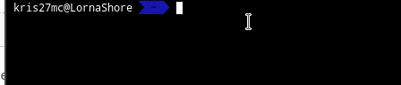

# java-jnumbernamer
A command-line utility to name arbitrarily sized numbers using the Conway-Wechsler system. Its only limit is the amount of RAM you have to store it!

# Documentation
Just run the command with the argument:

    $ java-jnumbernamer "$number"

Where $number is equal to the integer you'd like to convert.  

Example:

    $ java-jnumbernamer 5
    five

Running the command without arguments will cause it to read from the standard input. You can use this to pipe numbers into it.

Examples:

    $ echo 27^270 | bc  | java-jnumbernamer
    two hundred ninety-three septemviginticentillion nine hundred eleven sesviginticentillion three hundred twenty-six quinquaviginticentillion five hundred forty-five quattuorviginticentillion three hundred ninety-five tresviginticentillion twenty-five duoviginticentillion four hundred ninety-seven unviginticentillion four hundred fifty-seven viginticentillion five hundred sixty-nine novendecicentillion four hundred ninety-one octodecicentillion five hundred twenty-four septendecicentillion five hundred seven sedecicentillion two hundred thirty quinquadecicentillion six hundred fifty-eight quattuordecicentillion eight hundred sixty-five tredecicentillion eight hundred seventy-four duodecicentillion five hundred ninety undecicentillion nine hundred twenty decicentillion nine hundred thirty-five novencentillion three hundred thirty-seven octocentillion nine hundred twenty-two septencentillion six hundred eighty-eight sexcentillion nine hundred seventy-one quinquacentillion two hundred seven quattuorcentillion seven hundred one trescentillion two hundred six duocentillion four hundred sixty uncentillion five hundred forty-nine centillion six hundred thirty-seven novenonagintillion four hundred sixteen octononagintillion eighty-nine septenonagintillion four hundred senonagintillion sixty-eight quinquanonagintillion three hundred eighty-two quattuornonagintillion five hundred sixty-one trenonagintillion four hundred ninety duononagintillion eight hundred ninety-nine unnonagintillion nine hundred eighty-five nonagintillion five hundred sixty-nine novemoctogintillion three octooctogintillion three hundred eighty-seven septemoctogintillion four hundred seventeen sexoctogintillion seven hundred seventy-four quinquaoctogintillion five hundred twenty-four quattuoroctogintillion fifty-eight tresoctogintillion nine hundred ninety duooctogintillion one hundred ninety-four unoctogintillion five hundred eight octogintillion three hundred twenty-seven novenseptuagintillion two hundred sixty-three octoseptuagintillion eight septenseptuagintillion two hundred thirty-four seseptuagintillion four hundred sixty-three quinquaseptuagintillion nine hundred thirty-five quattuorseptuagintillion seven hundred fifteen treseptuagintillion five hundred forty-three duoseptuagintillion two hundred ten unseptuagintillion four hundred forty-nine septuagintillion six hundred thirty-two novensexagintillion two hundred seventy-eight octosexagintillion six hundred eighty septensexagintillion nine hundred fifty-seven sesexagintillion nine hundred eighty-nine quinquasexagintillion eight hundred seventeen quattuorsexagintillion five hundred twenty-seven tresexagintillion thirty-six duosexagintillion four hundred unsexagintillion six hundred ninety-two sexagintillion two hundred thirty-seven novenquinquagintillion five hundred sixty-eight octoquinquagintillion three hundred ninety-eight septenquinquagintillion six hundred forty-six sesquinquagintillion eight hundred ninety-six quinquaquinquagintillion seven hundred eleven quattuorquinquagintillion one hundred three tresquinquagintillion four hundred four duoquinquagintillion six hundred eighty-one unquinquagintillion eight hundred eighty-six quinquagintillion seven hundred eighty-three novenquadragintillion two hundred eighty octoquadragintillion three hundred thirty-one septenquadragintillion five hundred fifty-three sesquadragintillion one hundred ninety-two quinquaquadragintillion two hundred thirty-seven quattuorquadragintillion six hundred eighty-one tresquadragintillion sixteen duoquadragintillion eight hundred eighty unquadragintillion nine hundred thirty-eight quadragintillion three hundred eighty-seven noventrigintillion two hundred forty-three octotrigintillion three hundred fifty-eight septentrigintillion one hundred sixty-four sestrigintillion seventy-two quinquatrigintillion nine hundred seventy-eight quattuortrigintillion one hundred eighty-eight trestrigintillion four hundred fifty-five duotrigintillion two hundred fifty-one untrigintillion two hundred ninety-eight trigintillion five hundred fifty-five novemvigintillion nine hundred twenty-three octovigintillion eight hundred eight septemvigintillion six hundred fifty-one sesvigintillion eight hundred eighty-nine quinquavigintillion three hundred eighty-nine quattuorvigintillion five hundred ninety-one tresvigintillion one hundred seventy-nine duovigintillion two hundred thirty-three unvigintillion four hundred twenty-three vigintillion eight hundred ninety novendecillion eight hundred ten octodecillion seven hundred fifty-seven septendecillion one hundred twenty-five sedecillion nineteen quinquadecillion four hundred thirty-eight quattuordecillion six hundred fourteen tredecillion three hundred eighty duodecillion six hundred fifty-seven undecillion nine hundred nineteen decillion eight hundred forty-five nonillion seven hundred ninety-nine octillion two hundred fifty-two septillion eight hundred thirty-seven sextillion one hundred sixty-nine quintillion six hundred nine quadrillion three hundred four trillion eight hundred eighty billion five hundred eighty million six hundred eighty-three thousand forty-nine

    $ echo 10^3006 | bc | java-jnumbernamer
    one millimillion

    $ sudo head /dev/sda | java-jnumbernamer
    one vigintillion three hundred seventy-six novendecillion three hundred twenty-two octodecillion three hundred twenty-two septendecillion twelve sedecillion three hundred forty-five quinquadecillion six hundred seventy-eight quattuordecillion nine hundred one tredecillion three hundred forty-five duodecillion six hundred seventy-eight undecillion thirteen decillion five hundred seventy-eight nonillion three hundred fifty-eight octillion twelve septillion three hundred forty-six sextillion seven hundred eighty-nine quintillion twelve quadrillion three hundred forty-five trillion six hundred eighty-nine billion twelve million three hundred forty-five thousand six hundred seventy-eight
    (NOTE: May vary on different computers)

You can also just type the number followed by Ctrl-D or whatever EOF is.

The input can be any decimal integer. All non-digit characters will be automatically removed. The number is assumed to be negative if there is a minus sign preceding all digits. If there are no digits in the input, it will just output a newline.

# Note

If you find an input that produces an output that differs from the standard described in the Conway-Wechsler system, or if you find any other problems with the utility please feel free to contact me:

jackxuanliu@gmail.com

# An Additional Note
I made this years ago when I was *really* bad at java. As a result, the source code is absolutely horrendous and unreadable.
